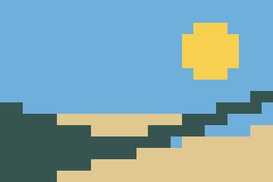

# Mosaic Parts Planner

Turn a PNG or JPEG into a flat, single-layer mosaic of 1×1 tiles using the colors and quantities you actually have. This offline Python CLI writes a preview, a placement grid, a parts list, and self-contained printable instructions. Every grid cell receives one tile; no color exceeds its inventory.



The example is intentionally inventory-constrained: it needs substitutes for 73 dark-teal tiles. This preserves buildability, at a substantial cost in RGB matching error. The software does not claim perceptual superiority or accurate physical color matching.

## Install

Requires Python 3.10 or newer and Pillow 12.1.1. Tested with Python 3.12 on Linux. From a checkout:

```sh
python3 -m venv .venv
.venv/bin/python -m pip install .
.venv/bin/mosaic-parts --help
```

On Windows, use `.venv\Scripts\python.exe` and `.venv\Scripts\mosaic-parts.exe`. If creating a venv reports missing `ensurepip`, install your operating system's Python venv support first. Initial installation needs the dependency packages; conversion needs no network, credentials, paid services, model, or GPU.

For installation on a disconnected machine, prepare wheels on a connected machine with the **same Python/platform**:

```sh
python3 -m pip wheel --wheel-dir wheelhouse .
# Transfer wheelhouse to the disconnected machine, create its venv, then:
.venv/bin/python -m pip install --no-index --find-links wheelhouse mosaic-parts-planner
```

This is a local package; no registry publication is required.

## Try the complete example

Use new output paths; existing directories are deliberately refused.

```sh
.venv/bin/mosaic-parts example --output example-output/input
.venv/bin/mosaic-parts convert example-output/input/source.png \
  --inventory example-output/input/inventory.json \
  --width 24 --height 16 --output example-output/plan
.venv/bin/python scripts/check_bundle.py \
  example-output/plan example-output/input/inventory.json
```

Open `example-output/plan/instructions.html` locally in a browser. It contains an embedded overview, numbered color key, overall parts totals, and one build sheet per section. Print at 100% on A4 or Letter. The diagrams are not physical-size templates. Color numbers work even if background colors are not printed. The sample input and preview are also in [examples](examples/README.md).

For your own photo:

```sh
.venv/bin/mosaic-parts convert photo.jpg --inventory inventory.json \
  --width 32 --height 32 --fit cover --background '#ffffff' \
  --section-size 8 --output my-mosaic
```

Inventory is a UTF-8 JSON file:

```json
{
  "colors": [
    {"name": "Warm white", "rgb": [240, 235, 220], "available": 600},
    {"name": "Charcoal", "rgb": [40, 42, 44], "available": 500}
  ]
}
```

Color IDs are the **one-based order in this file**. Names must be unique ignoring case, 1–80 printable characters, and have no surrounding spaces. RGB channels must be integers in 0–255; available counts must be integers in 0–1,000,000,000. Boolean and fractional numbers, duplicate JSON keys, unknown fields, and duplicate names are rejected. Zero stock is allowed. Colors may have the same RGB approximation but distinct names. All counts refer to interchangeable **1×1 tiles**, not sets, bags, or larger pieces.

The combined inventory must cover `width × height`. Errors return exit code 2 and describe the needed correction. Output is staged and only moved into place when all exports succeed; ordinary failures do not leave a partial output directory. Existing output is never intentionally overwritten. Interrupted processes may leave a hidden staging directory next to the requested output; it can be removed after confirming no conversion is running.

## Image policy and resource limits

- `contain` (default) preserves the full image and centers it on the background color. Fitted dimensions round to the nearest integer (ties to even), with a minimum of one pixel. An odd extra padding pixel goes on the right or bottom. Padding cells still need tiles.
- `cover` preserves aspect ratio, center-crops to fill the grid, and can remove image content.
- `stretch` fills the grid by changing aspect ratio.
- EXIF orientation is applied before fitting, including mirrored orientations. Instructions then show the **front view**: row 1, column 1 is top-left, columns increase right, rows increase down. Do not mirror them for assembly.
- Transparency, including palette transparency, is composited over `--background` **before** Lanczos resampling. Semi-transparent colors blend with that matte. The default is white. There are no empty cells.
- Input is interpreted as 8-bit encoded RGB. Grayscale, palette, RGB, and RGBA PNG/JPEG images are supported. ICC profiles and gamma metadata are not used for color management; convert to an 8-bit sRGB image externally when needed. CMYK and 16-bit images are rejected. Generated PNGs do not retain EXIF or ICC metadata.
- Animated PNGs and formats other than PNG/JPEG are rejected. File content determines format, not the filename extension. Corrupt images produce an error.

| Resource | Limit |
| --- | ---: |
| Grid | 1–128 columns and rows; at most 1,024 cells total |
| Inventory | 1–32 colors; file at most 128 KiB |
| Input image | 20 MiB; 16,000,000 pixels; 8,192 pixels on either side |
| Printed section | 1–16 rows/columns (default 8) |
| Preview scale | 16 image pixels per tile |

These caps bound graph size and image decoding. Exact optimization is intended for small mosaics; this is not a large-poster tool. Peak image memory is several times the uncompressed input size. The maximum accepted image size does not imply a constant memory or runtime guarantee.

## Output contract

All files are deterministic for identical input bytes, inventory order, options, package version, and imaging environment. No timestamps, absolute source paths, or random values are exported. Source bytes are identified by SHA-256. Reordering the inventory can change color numbers and tie outcomes. Cross-version/platform image-decoder equivalence is not guaranteed; the Pillow version is recorded and pinned.

| File | Contents |
| --- | --- |
| `preview.png` | Nearest-neighbor enlargement of the chosen tile colors, 16 pixels per tile |
| `target.png` | Exact fitted and composited grid-resolution RGB target used for optimization |
| `placements.json` | Schema version 1, dimensions, image provenance, settings, inventory, usage, and row-major `grid` of one-based color IDs |
| `parts.csv` | ID, name, RGB, available, used, remaining for every color, including unused colors |
| `instructions.html` | Standalone, no JavaScript or remote assets; visible global coordinates, numbered colors, and per-section totals |
| `comparison.json` | Constrained and unconstrained errors, counts, inventory excess, and the nearest-color placement vector |

`grid[row - 1][column - 1]` is the color ID to place. CSV names starting with `=`, `+`, `-`, or `@` gain a leading apostrophe to prevent spreadsheet formula evaluation; their original names remain in JSON and escaped HTML. HTML sections are ordered left-to-right, then top-to-bottom. Section totals count only cells in that section.

## Assignment objective and related work

For target pixel `p_i` and palette RGB `c_j`, the cost is:

```text
sum over cells i of [(p_i.red - c_j.red)^2
                  + (p_i.green - c_j.green)^2
                  + (p_i.blue - c_j.blue)^2]
subject to one color per cell and usage[j] <= available[j].
```

The solver constructs a capacitated minimum-cost flow network, groups identical target pixels, and uses successive shortest augmenting paths with integer costs and node potentials. Reverse residual edges permit reassignment of earlier choices. This computes a global optimum for this objective, rather than a nearest-available greedy choice. Equal-cost solutions use deterministic graph/input order; identical target pixels receive their allocated colors in inventory order and row-major occurrence order. This can produce visibly structured substitutions. No dithering, texture, edge, or spatial-coherence objective is included.

The algorithm follows standard min-cost-flow ideas described in [Algorithms II: successive shortest paths](https://web.cs.dal.ca/~nzeh/Teaching/4113/book/mincostflow/successive_shortest_paths/algorithm.html). This implementation does not claim a new algorithm. Existing [Lego Art Remix](https://github.com/debkbanerji/lego-art-remix) and its [interactive application](https://lego-art-remix.com/) already convert images into mosaics with piece availability. This project's scope is a small offline CLI, explicit input policies, and independently verifiable exports. It is not affiliated with those projects or any tile manufacturer.

Squared encoded-RGB error is convenient, integer-valued, and auditable; **it is not perceptual color distance**, linear-light error, or a prediction of how physical tiles look. The unconstrained baseline chooses the closest inventory-listed RGB for each cell, ignoring stock (including zero-stock colors). Its error is a lower bound, and it can be impossible to assemble. [Reproducible experiments](experiments/README.md) record both error and inventory violations without treating higher error as an improvement.

## Verify

After installing, from the checkout:

```sh
.venv/bin/python -m unittest discover -s tests -v
.venv/bin/python scripts/compare.py --check experiments/results.json
```

The tests cover exhaustive tiny assignments, seeded three-color cases, all EXIF orientations, fitting, transparency, limits, malformed inputs, export failure cleanup, HTML escaping, reproducibility, and independent instruction reconstruction. `scripts/check_bundle.py` does not import the planner. It reads the **visible** HTML table labels and numbers, reconstructs every coordinate, checks section and overall counts against the original inventory, and verifies JSON, CSV, all preview pixels, the embedded overview, and both error calculations. Deliberate instruction corruption is tested to ensure the checker rejects it.

To verify an isolated offline wheel installation (host pip 22.3+):

```sh
.venv/bin/python -m pip wheel --wheel-dir .wheelhouse .
.venv/bin/python scripts/verify_install.py --wheelhouse .wheelhouse
```

The verifier creates a fresh temporary venv with no system packages, installs only from the supplied wheels using `--no-index`, runs the example twice, compares all six output files byte-for-byte, and runs the tests and saved experiments against the installed package. A Python audit hook blocks socket creation/connection during execution; it is a verification guard, not an OS-level network sandbox. The application itself contains no networking code.

## Limitations

Sample colors are illustrative, not official product color data. Physical tile matching, acquisition, fit, assembly, durability, and human usability remain unverified. Inventory counts are trusted as supplied. Backing plates, frames, adhesives, spare pieces, shipping, and prices are outside the parts list. Only flat, single-layer 1×1 tile mosaics are modeled; there are no larger pieces, rotations, depth maps, or structural checks. Instructions are HTML for browser printing, not a PDF export service. RGB optimization can sacrifice recognizable image features when a color is scarce. No human perceptual study has been run.

Optional capacity and browser-print checks:

```sh
.venv/bin/python scripts/stress.py
.venv/bin/python -m pip install -r requirements-print.txt
.venv/bin/python -m playwright install chromium --only-shell
.venv/bin/python scripts/check_print.py --output example-output/print-check
```

The print check saves screenshots and A4/Letter PDFs, checks for remote requests and browser errors, and verifies that each section and its totals share a PDF page. It covers the six-section landscape and a dense 16×16 section containing all 32 colors, with PDF background printing disabled. Chromium was exercised; printer hardware and other browser engines remain unverified. The optional browser download is needed only for this check, never for conversion.
