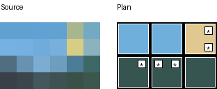

# Joint color and piece planning

`optimize` chooses colors and rectangular pieces together. It minimizes the
**number of pieces**, subject to the supplied piece counts, exact coverage and a
user-specified **total integer squared-RGB error budget**. It supports up to 64
cells and eight palette colors, with 1×1, optionally rotatable 1×2, and 2×2 pieces.

## Complete offline example

Install as described in the main README. Use a new output directory:

```sh
.venv/bin/mosaic-parts optimize examples/source.png \
  --palette examples/joint-palette.json --inventory examples/pieces.json \
  --width 6 --height 4 --error-budget 200000 --section-size 3 \
  --output example-output/joint
```

Open `example-output/joint/instructions.html` locally. The sample has **six
pieces, proven optimal**, achieved error **108,783**, and budget **200,000**.
Five cells differ from their nearest palette color. Six is the area lower bound
for 24 cells covered by pieces of area at most four. This is not a claim about
perceptual quality. The historical fixed-color example still uses ten pieces;
it fixes a different color grid and is not itself a controlled benchmark.



The palette is independent of stock:

```json
{"schema_version": 1, "colors": [
  {"id": 1, "name": "Dark", "rgb": [30, 30, 30]},
  {"id": 2, "name": "Light", "rgb": [230, 230, 230]}
]}
```

IDs must be consecutive from 1. Names are unique ignoring case, printable,
1–80 characters, and trimmed. RGB channels are integers 0–255. Distinct names
may have equal RGB. Palette JSON has exactly `schema_version` and `colors`;
color records use the same normalization as fixed-color grid records.

Piece inventory uses the existing [packing format](packing.md):

```json
{"schema_version": 1, "pieces": [
  {"color_id": 1, "shape": "1x2", "available": 12, "rotate": true},
  {"color_id": 2, "shape": "2x2", "available": 6, "rotate": false},
  {"color_id": 2, "shape": "1x1", "available": 8, "rotate": false}
]}
```

Each color/shape pair is unique; omitted pairs have zero stock. Both orientations
share the same 1×2 count. Rotation `true` is permitted only for 1×2. Counts are
integers 0–1,000,000,000. Colors and their stock are illustrative sample data.

## Sampling and objective

Sampling reuses the conversion pipeline: PNG/JPEG decode, EXIF orientation,
alpha composition over the RGB background (white by default), then Pillow
12.1.1 LANCZOS to the requested grid. `--fit contain` is the default; `cover` and
`stretch` are supported. Contain rounds fitted dimensions with Python's
ties-to-even rule, clamps each to at least one, and centers with extra odd
padding on the right/bottom. Cover uses centered cropping. Color profiles and
gamma metadata are not used for color management. See the README image policy.

The exported `problem.pixels` stores these exact 8-bit samples, row-major. For
source sample `s[i]` and the color `c[i]` reconstructed from the covering piece:

```text
error = sum over cells i and channels k of (s[i][k] - palette[c[i]][k])²
minimize number of pieces, subject to error <= error_budget
```

This is numerical encoded-RGB error, **not perceptual fidelity**, linear-light
error, or measured physical color. Errors and all decisions use exact integers;
there are no feasibility or optimality tolerances. The optimizer does not
minimize error among equal-piece plans. An optimal plan can leave budget unused
or have higher error than another equally small plan.

“Recolored” means differing from the nearest palette color, ignoring stock and
breaking ties by lowest color ID. It does not mean differing from a preceding
capacity-constrained conversion. Stars on the preview and a printed coordinate
list identify these cells; source samples and the full chosen grid are in JSON.

## Solver and bounds

Candidates are rectangles with a stock item, color, orientation and additive
error. DFS branches at the first uncovered cell in row-major order. Any
nonoverlapping rectangular cover must have a piece anchored at that cell:
starting earlier would overlap an already covered cell. Trying every fitting
stock item and orientation there is complete. Branch-and-bound relaxes geometry
when computing inventory-area piece lower bounds, and relaxes stock/geometry
for the sum of per-cell minimum color errors. Both are lower bounds. Two greedy
orders can seed incumbents; neither is used as an infeasibility proof.

| Resource | Bound |
| --- | ---: |
| Grid | 1–64 cells; each side 1–64 |
| Palette | 1–8 colors; at most 24 unique stock types |
| Candidate rectangles considered | at most 64 × 8 × 4 = 2,048 |
| DFS depth | at most 64 |
| DFS visits | default 100,000; `--node-limit` 0–2,000,000 |
| Solver time | default 10 seconds; `--time-limit` finite 0–300 |
| Error budget | integer 0–12,484,800 (maximum error of any 64-cell plan) |
| Palette/inventory JSON | each at most 256 KiB |
| Source image | 20 MiB; 16 million pixels; side at most 8,192 |
| Print section side | 1–8; at most 64 sections |
| Bundle | five files for a solution, each guarded at 10 MiB |
| Preview | at most 3,096 × 1,568 pixels; actual shape follows the grid |

Preprocessing and greedy passes count toward solver time, but not DFS nodes.
The wall limit is **cooperative**, checked at each anchor, greedy iteration,
and DFS visit. It excludes image decoding, input validation and export. It is
not a hard OS deadline or a constant-memory guarantee for image decoding.
Candidate generation is structurally capped, search has no unbounded cache,
and print lists contain at most 64 pieces. Externally terminate the process if
a hard whole-command deadline is needed; an abrupt kill may leave hidden staging.

| Status | Meaning | CLI exit |
| --- | --- | ---: |
| `optimal` | feasible incumbent and exhausted search / sound bound proof | 0 |
| `feasible` | independently validated incumbent; limit stopped proof | 0 |
| `infeasible` | exhausted search proves no plan within the budget | 3 |
| `unknown` | limit reached without an incumbent; no infeasibility claim | 4 |
| input/solver/export error | rejected; no new completed bundle | 2 |

`termination` distinguishes `exhausted`, `node_limit`, and `time_limit`.
`lower_bound` is a possibly loose inventory-area bound at the root, not a final
optimality gap. Inventory with ample area can still be geometrically infeasible.
A zero node budget can return a greedy incumbent. A zero time budget returns
unknown. Internal solver exceptions are reported as failures, not infeasibility.

## Artifacts and validation

A successful solution writes version **3** `placements.json`, `solve.json`,
`preview.png`, `parts.csv`, and self-contained `instructions.html`. Version 1
conversion grids and version 2 fixed-color rectangular plans remain supported
by their original commands; do not pass a v3 plan directly to `pack`.

The v3 plan records the normalized problem (including budget and samples),
normalized inventory, generator/Python/Pillow versions, search settings/result,
placements, reconstructed `input_grid`, and zero-based row-major
`recolored_cells`. Each placement records consecutive ID, color ID, shape,
zero-based x/y, width, height, rotation. Image-origin plans also record source
SHA-256, source mode/size, EXIF-oriented size, fit and background. `solve.json`
retains inputs and settings even when no solution is available. No-solution
bundles contain only that report: no fake preview or assembly instructions.

The independent validator imports no joint candidate, bitmask or cost code. It
fills a new coordinate grid, rejects overlaps/gaps/out-of-bounds placements,
then checks explicit allowed orientations and shared stock counters. It sums
RGB error directly from source samples and reconstructed colors, checks budget
and piece count, and binds exported copies and recolor metadata to the original
normalized inputs. It validates feasibility; **it does not independently certify
the optimality proof**. Exhaustive tests provide separate evidence for search.

`scripts/check_joint.py BUNDLE PROBLEM_JSON INVENTORY_JSON` additionally compares
CSV totals and visible instruction cells/placement lists. `PROBLEM_JSON` uses
the same fields as `problem` in the v3 plan; obtain it from original inputs with
`joint_export.load_problem` for an independent source binding (the offline
installation verifier does this). Output is staged next to the destination,
cleaned on ordinary failures, and renamed only after validation/export. Existing
paths, including symlinks, are refused. Use one writer per output path; this is
not a hostile-filesystem concurrency protocol.

For identical input bytes, settings and imaging environment, node-bounded runs
are deterministic if they do not hit the wall limit. Deadline interruptions can
change incumbents and statuses across machines. Python/Pillow versions are
recorded; cross-version/platform decoder equivalence is not promised. Outputs
contain no timestamps or absolute input paths.

## Verification and related work

After installation, obtain optional verification dependencies and Chromium:

```sh
.venv/bin/python -m pip install -r requirements-print.txt
PLAYWRIGHT_BROWSERS_PATH=/tmp/mosaic-browser .venv/bin/python -m playwright install chromium
# Prepare the pinned Pillow wheel for the current Python/platform if needed:
.venv/bin/python -m pip download --only-binary=:all: --dest .wheelhouse Pillow==12.1.1
```

With those prerequisites present, one command performs the milestone checks
without downloading dependencies:

```sh
PLAYWRIGHT_BROWSERS_PATH=/tmp/mosaic-browser .venv/bin/python scripts/verify_joint.py
```

It builds the wheel offline (requires setuptools>=77 in the host environment),
installs into a fresh venv, blocks Python socket operations while exercising the
installed CLI twice, runs all unit tests including 248 exhaustive joint cases,
checks historical experiments and the frozen joint suite, runs capacity checks,
and exercises all instruction families in Chromium. Joint browser checks use
an offline context and abort HTTP(S), then check A4/Letter PDF section integrity.
See [recorded results and unsuccessful cases](../experiments/joint.md).

This is an extension of the existing min-cost-flow conversion and exact-cover
packing implementations in this repository. It claims no algorithmic novelty.
[Knuth's exact-cover programs](https://cs.stanford.edu/~knuth/programs.html) and
[Dancing Links](https://arxiv.org/abs/cs/0011047) provide established background;
this implementation uses integer bitmasks and counters, not dancing links.
[Pillow's image operations](https://pillow.readthedocs.io/en/stable/reference/Image.html)
document the sampling primitives. [Lego Art Remix](https://github.com/debkbanerji/lego-art-remix)
is existing image-to-mosaic software with inventory support; this project is
an offline, bounded CLI with auditable rectangular plans, not a novelty claim
or a comparison against that application's quality.

Physical piece availability, color matching, fit, structural stability, backing
plates, frames, adhesives and human assembly remain unverified/out of scope.
No hardware printing or perceptual study was performed. Larger mosaics may
terminate with only an incumbent or none; this is not a general large-mosaic
optimizer.
