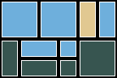

# Rectangular packing

`mosaic-parts pack` packs an existing, fixed-color grid using a separate inventory
of color-specific 1×1, 1×2, and 2×2 pieces. It minimizes the number of pieces.
It never changes the grid's colors. This is a second step after image conversion;
the two objectives are **not jointly optimized**.

## Complete offline example

After installing the package from the checkout, run from the checkout root:

```sh
.venv/bin/mosaic-parts convert examples/source.png \
  --inventory examples/inventory.json --width 6 --height 4 \
  --output example-output/rectangle-grid
.venv/bin/mosaic-parts pack example-output/rectangle-grid/placements.json \
  --inventory examples/pieces.json --section-size 3 \
  --time-limit 10 --node-limit 100000 --output example-output/rectangles
.venv/bin/python scripts/check_packing.py example-output/rectangles \
  example-output/rectangle-grid/placements.json examples/pieces.json
```

The 24-cell sample packs into **10 pieces, proven optimal**. Open
`example-output/rectangles/instructions.html` locally. All images and instructions
are self-contained. Section size 3 deliberately demonstrates three pieces
crossing section boundaries; the resulting A4/Letter instructions use ten pages.
The default section size 8 uses fewer sheets. Existing output paths are refused.
The example inventories are illustrative, not measured physical stock.



For a disconnected installation, prepare the project and Pillow wheels on the
same Python/platform using the instructions in the main README. Runtime performs
no network operations. No additional optimization dependency is required.

## Grid input

The input is the **schema version 1** `placements.json` written by `convert`.
A minimal hand-written equivalent is also accepted:

```json
{
  "schema_version": 1,
  "width": 2,
  "height": 1,
  "colors": [{"id": 1, "name": "Sample blue", "rgb": [30, 70, 150]}],
  "grid": [[1, 1]]
}
```

Color IDs must be consecutive integers starting at 1. All grid entries must be
known color IDs. Colors have unique printable names, 1–80 characters without
surrounding whitespace, and three integer RGB channels in 0–255. Input metadata
such as the original image hash, single-tile `available`/`used` values, settings,
and generator fields is ignored by packing: only dimensions, color IDs/names/RGB,
and the grid are consumed. Original 1×1 stock does not constrain rectangular stock.
The normalized grid and complete rectangular inventory are copied into the output.
A packed schema version 2 plan is not itself a grid input; use its `input_grid`.

## Separate piece inventory

```json
{
  "schema_version": 1,
  "pieces": [
    {"color_id": 1, "shape": "1x1", "available": 0, "rotate": false},
    {"color_id": 1, "shape": "1x2", "available": 1, "rotate": true},
    {"color_id": 1, "shape": "2x2", "available": 0, "rotate": false}
  ]
}
```

Shape names are **width × height**. A `1x2` at 0° covers one column and two rows.
Only `1x2` can set `rotate: true`, permitting 90° (two columns and one row).
Both orientations consume the **same stock counter**. Squares require
`rotate: false`, and export only rotation 0. There is no independent `2x1` type.
Angles 180° and 270° are not accepted. Pieces are flat, single-layer rectangles.

One entry per color/shape pair is allowed. Missing pairs have zero stock; explicit
zero-stock entries are allowed. Inventory entry order has no meaning and is
canonicalized. Each entry must contain exactly the four fields shown. Counts are
integers in 0–1,000,000,000. Boolean/fractional coordinates and counts, duplicate
JSON keys, unknown inventory fields, unknown colors/shapes, and duplicate entries
are rejected. Names and RGB values come from the grid, so inventory IDs must refer
to that exact grid's color key.

## Bounds and result semantics

| Setting | Default | Accepted range |
| --- | ---: | --- |
| Grid cells | From input | 1–256 |
| Width / height | From input | 1–64, subject to cell limit |
| Colors | From input | 1–32 |
| Inventory entries | From input | 1–96 |
| Bytes per input JSON | — | At most 262,144 |
| `--time-limit` | 10 seconds | Finite number, 0–300 |
| `--node-limit` | 100,000 | Integer, 0–2,000,000 |
| `--section-size` | 8 | Integer, 1–8 |

The original `convert` limits remain 1,024 cells and 128 cells per side. Reduce the
conversion dimensions before packing a larger conversion plan; packing does not
crop or resize an existing grid.

The wall budget covers candidate generation, initial greedy packing, and DFS.
It is checked at each grid anchor, greedy placement, and search-node entry.
This is a cooperative monotonic deadline, **not an OS hard execution deadline**:
input validation, final integer plan validation, rendering, disk I/O, and bounded
work between checks add overhead. Candidate generation is at most 1,024 legal
rectangles; recursion depth is at most 256 placements. No growing search cache
is retained. The search-effort bound counts entered DFS nodes; preprocessing and
the single greedy pass do not consume nodes. Thus `--node-limit 0` may return a
greedy incumbent, while `--time-limit 0` returns no solution without searching.

| `result.status` | Meaning | CLI exit | Files |
| --- | --- | ---: | --- |
| `optimal` | Validated minimum piece count; search exhausted or all branches pruned by valid bounds | 0 | Full bundle |
| `feasible` | Validated incumbent; budget expired before a proof | 0 | Full bundle |
| `infeasible` | Exhaustive search proved no inventory-respecting cover exists | 3 | `solve.json` only |
| `unknown` | Budget expired with no incumbent; says nothing about feasibility | 4 | `solve.json` only |
| Input / I/O / solver error | No usable result | 2 | No new output directory |

An insufficient area or impossible geometry can prove infeasibility. A failed
greedy attempt cannot. A cutoff is never labeled infeasible or optimal, even if an
external observer can recognize a trivial proof. `termination` is `exhausted`,
`time_limit`, or `node_limit`. `lower_bound` is a conservative **root** piece-count
bound, not a final search-frontier bound; it can be weaker than an optimal count.
It is null when root stock cannot cover the relaxed required area. Optimality is
a solver assertion checked against an independent oracle on tiny cases, not a
separately exported formal certificate.

## Algorithm and validation

Each candidate is a same-color rectangle at an integer grid position with an
allowed orientation. Candidates are sorted by descending area, then canonical
inventory entry and rotation. A greedy row-major pass supplies an incumbent when
possible. Branch-and-bound then considers every legal piece anchored at the first
uncovered row-major cell. This is complete: in any disjoint rectangular cover,
the rectangle covering that cell must have its top-left there; an earlier anchor
would overlap an already covered cell.

The objective is the number of rectangles. Inventory counters and bit masks
prevent reuse and overlap during search. The lower bound sums, per color, the
fewest available piece areas needed to meet remaining area, disregarding geometry
and allowing the last area to overfill. Shapes having no legal candidate anywhere
are omitted. This relaxation cannot exceed the number of pieces in a valid
completion. Branches unable to improve the incumbent are pruned. Equal-count
solutions keep the first deterministic incumbent; all optimal tilings are not
returned. An exponential search can still exhaust its budget on a small grid.

`packing_validate.py` independently walks every exported rectangle's integer
coordinates, reconstructing cells without solver candidates, masks, or shared
orientation-generation code. It rejects gaps, overlaps, color changes,
out-of-bounds coordinates, forbidden orientations, inconsistent dimensions, and
inventory violations. This runs before export, including for interrupted
incumbents. A second checker, `scripts/check_packing.py`, imports no solver or
package modules and compares the original inputs against JSON, the **visible HTML
tables**, CSV totals, preview colors/boundaries, and embedded image. These checks
establish discrete feasibility; they do not prove optimality or structural stability.

## Output format and printing

A successful bundle contains:

- `solve.json`: version 1 report with generator versions, settings, status,
  termination, nodes, piece count, and root lower bound. No timing measurements.
- `placements.json`: version 2 rectangular plan, normalized `input_grid`, separate
  `inventory`, settings/result, and a `placements` array. Each piece has integer
  `id`, `color_id`, `x`, `y`, `width`, `height`, `rotation`, and a string `shape`.
  IDs are consecutive starting at 1; x/y are **zero-based**, top-left origin,
  columns right, rows down. Width/height describe the oriented rectangle.
- `preview.png`: 24 pixels per cell, with black and white piece-edge outlines.
- `parts.csv`: every inventory entry with color/name, shape, rotation permission,
  available, used and remaining. Both orientations share one parts total. Names
  beginning with spreadsheet formula prefixes receive a protective apostrophe.
- `instructions.html`: overview, color key, totals, section diagrams, and separate
  placement-list pages (at most 24 rows each). Zero-stock entries are omitted from
  the printed totals to save paper; they remain in CSV and JSON.

The directory is staged and renamed only after validation and rendering succeed.
No overwrite/resume behavior is provided; use a fresh destination. Concurrent
processes must use distinct output paths.

Printed coordinates are **one-based**, front view. Cell labels `P1`, `P2`, …
identify whole pieces, not colors. A piece's **owner section** contains its top-left
cell. Its full row/column span and orientation are listed there exactly once;
“Touches” lists all sections covered. Other sections show the same ID and its
owner. Heavy solid borders mark actual edges; dashed section edges continue a
piece. Never cut pieces at section boundaries. Assemble the sections on a
continuous surface and reserve neighboring cells for crossing pieces. Numbered
piece/color keys remain usable without background-color printing.

## Reproduction and limitations

The solver uses integer arithmetic and deterministic iteration, with no random
branching or external optimizer. Completed solves and node-limited solves that do
not reach the wall deadline have repeatable placements under the same Python,
Pillow, package version and settings. Cross-hash-seed CLI tests compare all output
bytes. Actual elapsed/CPU time is intentionally stored in experiment results,
not placement artifacts. A time-limited search can stop at different nodes and
produce different incumbents or no incumbent; those runs are not byte-reproducible.
Different Python/Pillow versions are not promised identical generated artifacts.
Tested versions are Python 3.12.3 and Pillow 12.1.1; Pillow is pinned at runtime.

Run the unit suite, exhaustive comparisons, isolated installation, and optional
Chromium checks as documented in [the experiment notes](../experiments/packing.md).
The physical palette, real piece availability, fit, backing plates, adhesives,
frames, stability, and assembly usability are unverified. A grid produced by
color optimization may be impossible to pack from your rectangular inventory.
No recoloring, product catalog lookup, purchasing, or structural optimization is
performed. More search effort can improve or prove a result, but cannot fix an
incompatible palette or inventory.

## Related work

The [LEGO Mosaic Generator](https://github.com/Galalon/lego_mosaic) README describes
single-tile and greedy tiling strategies with configurable tile shapes and
orientation handling. [brickr](https://github.com/ryantimpe/brickr) provides image
mosaics, color-palette controls, and brick model tooling. These are related image
and mosaic implementations; no performance comparison with them was run.

[Knuth, *Dancing Links*](https://arxiv.org/abs/cs/0011047) describes exact-cover
search and polyomino tiling. This implementation uses integer masks and stock
counters rather than dancing-links data structures. Fixed-color rectangular
packing and exact-cover search are established ideas; this project makes no
algorithmic novelty claim. Its useful scope is a small offline workflow with
explicit inventories, bounded search, independent feasibility checks, and
printable cross-section assembly coordinates. Sources inspected 2026-09-23.
